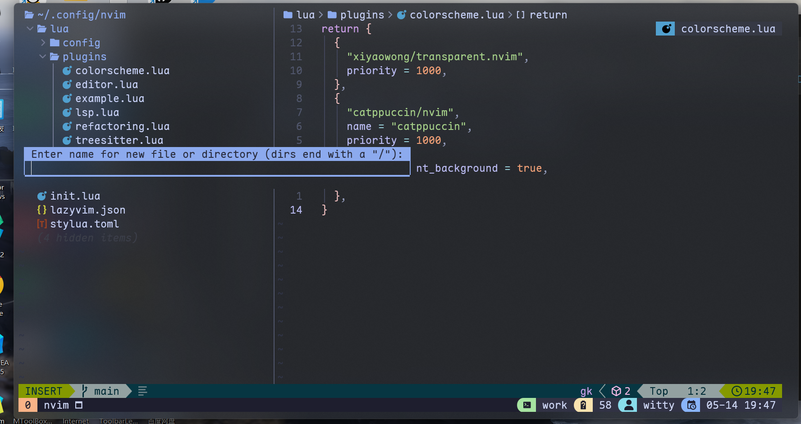
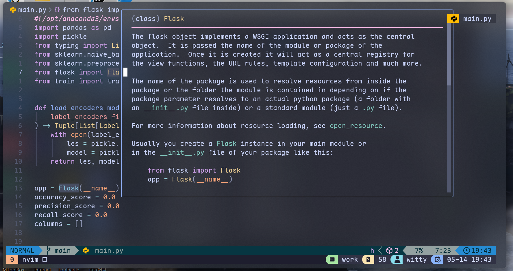
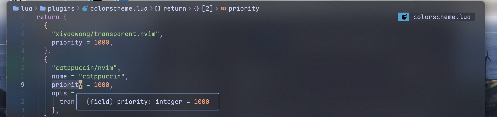
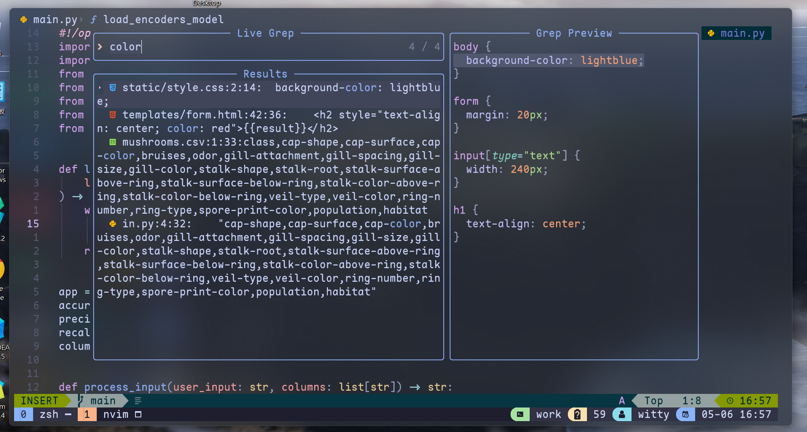
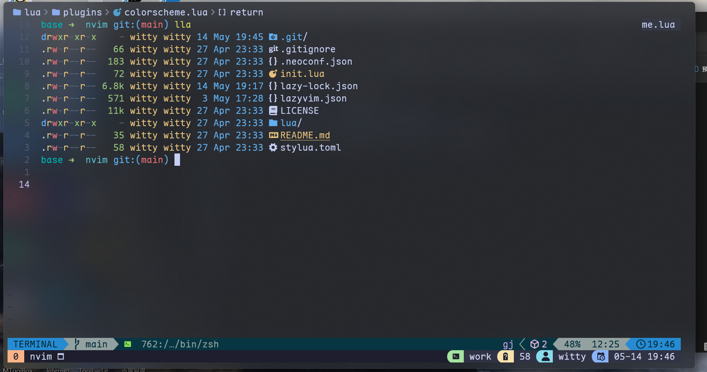
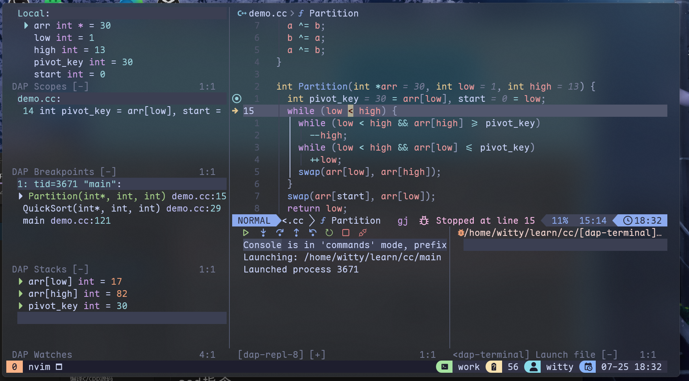

# NeovimStarter

my neovim config

forked from [LazyVim](https://github.com/LazyVim/starter.git)
Refer to the [documentation](https://lazyvim.github.io/installation) to get started.
**Pay attention to replace the url of lazyvim with the url of this repository when cloning.**

The display images are as follows:

My Terminal is [WindowsTerminal(preview)](https://github.com/microsoft/terminal).

The config file of WT is [here](https://github.com/WittyCo/Dotfiles/blob/main/windows/WindowsTerminal/settings.json).

The default shortcut key for switching focus mode (WT without border) is ALT+Z in my wt config.

Optional Requirements:

- [gcc/g++](https://winlibs.com/)
  It is suggested to download the gcc/g++ compiler with the ucrt runtime and LLVM/Clang/LLD/LLDB version.
  **Make c/cpp lsp--clangd in lua/plugins/lsp.lua point to clangd.exe in this software package, otherwise, clangd can't find the standard library of c/cpp, resulting in abnormal syntax.**
- [fd](https://github.com/sharkdp/fd)
  Search files.
- [ripgrep](https://github.com/BurntSushi/ripgrep)
  Search content from files.
- [tree-sitter](https://github.com/tree-sitter/tree-sitter)
  Provide advanced function by building syntax tree.
- [fzf](https://github.com/junegunn/fzf)
  Fuzzy search
- [Lua](https://github.com/DevelopersCommunity/cmake-lua)
- [Maple Mono NF (CN)](https://github.com/subframe7536/maple-font)
  a nerd font
- [lazygit](https://github.com/jesseduffield/lazygit)
  Quick installation suggestion: You can install it with pip or conda if you have python or anaconda.
- [Python](https://www.python.org/)
- [Node](https://nodejs.org/)

I use anaconda to manage python virtual environment, and neovim uses venv-selector plugin to switch python environment. **Pay attention to modifying anaconda path in lua/plugins/editor.lua**
(At present, due to the differences in the relative paths of python programs on various platforms, the plug-in for automatically selecting/switching python environment on windows cannot work normally, and Unix-like platforms do not have this problem.)
